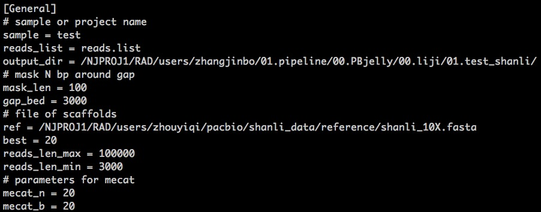
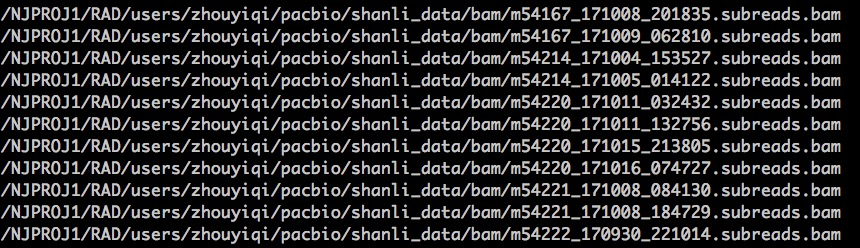

.. _ConfigandUsage:

Config and Usage
================================================================================

.. _PrepareConfig:

Prepare Config file
--------------------------------------------------------------------------------

First, you have to prepare a 'config.cfg', which contains the informations run_pbjelly requires to fish all the tasks, just as following:

An example of the config.cfg was stored in the cluster:

   > /NJPROJ1/RAD/users/zhangjinbo/01.pipeline/00.PBjelly/00.liji/01.test_shanli_3/config.cfg

Here, in the config.cfg, the reads.list store all the paths for the long reads files, for example:

For more information about the parameters in config.cfg, you can refer to the part *Parameters* 
under the section *Overview*.

.. _Usage:

Usage
--------------------------------------------------------------------------------

It is very easy to use run_pbjelly, just as the following commands:

   > /NJPROJ1/RAD/software/anaconda2/bin/python  ../00.bin/run_pbjelly.py  config.cfg

Here comes a tested example:
   > /NJPROJ1/RAD/users/zhangjinbo/01.pipeline/00.PBjelly/00.liji/01.test_shanli_3

During this, it will generate all the dirs and shells for you, and it will also output the next action for you , for example:

   Please paste the following command line and Enter:

   nohup sh /NJPROJ1/RAD/users/zhangjinbo/01.pipeline/00.PBjelly/00.liji/01.test_shanli/nohup_run.sh >/NJPROJ1/RAD/users/zhangjinbo/01.pipeline/00.PBjelly/00.liji/01.test_shanli/4-logs/nohup_run.sh.log 2>/NJPROJ1/RAD/users/zhangjinbo/01.pipeline/00.PBjelly/00.liji/01.test_shanli/4-logs/nohup_run.sh.err &

