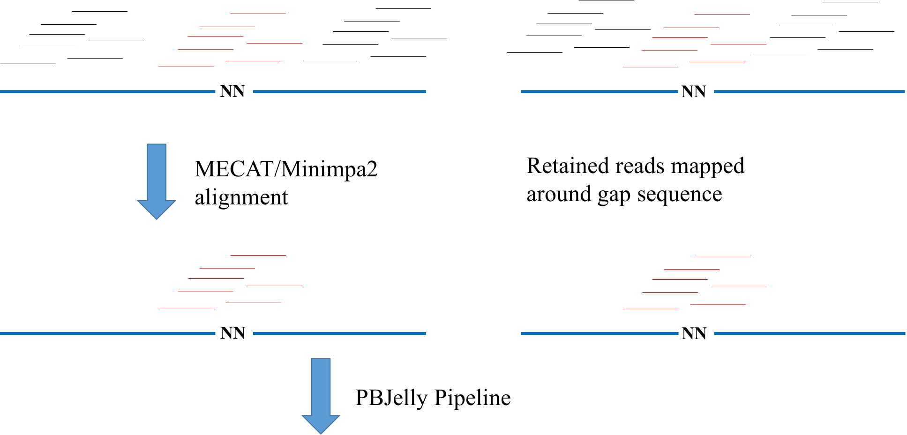

Overview
================================================================================

Scope and Features
--------------------------------------------------------------------------------

Just as shown in the following figure, we first use MECAT to do the alignment for all the raw reads and after that we can know the most possible locations of genome for those reads. Usually, only ~10% reads are mapped around gap regions(around 2kbp) and it waste a lot of time for PBJelly to do the alignment for the rest of reads with Blasr since those far away gap region reads were not used to do the local assembly and filled the gaps. So, we can speed up the PBJelly by first removing those reads. Besides, we found that the original PBJelly rudely collected reads to do the local assembly and doing this uasually gives poor results. So, with our approach, it will get better contig N50 value, sometimes.

run_pbjelly is intended to be easy to use but some
familiarity with commandline applications is expected. Rather than providing a
flexible solution to a number of common workflows, we have designed run_pbjelly to
be as fixed as possible, which can help you easily get the results without worrying about installing the other software and setting up path for these program. This design help you save a lot of time, but we suggest you should read the published PBJelly paper and related documents in case you have to do some specific test when the results do not meet the contract indicator.

run_pbjelly is composed of a set of standalone tools to perform specific tasks. A brief description of each tool is shown in the table below.

.. _FeatureTable:

.. csv-table::
   :file: tables/tool_summary.tsv
   :delim: tab
   :header-rows: 1
   :widths: 15, 10, 75

.. _InputOutput:

Input and Output
--------------------------------------------------------------------------------

For run_pbjelly, you have to prepared two files, the first one is the reference file name with fasta as end. The second file is 'reads.list' file where each line stores the path for the reads files independently. After these, you have to prepare a 'config.cfg' file, containing reference file path, reads.list, output dir and all kinds of parameters.

For more information, you can refer to the part 'Config and Usage' under the section  *Examples* . 

.. _Parameters:

Parameters
--------------------------------------------------------------------------------

There are mainly five steps in run_pbjelly, and all the important parameters were saved in the config.cfg file (see more details in the *Example* section). The parameters are shown as followed:

.. csv-table::
   :file: tables/para_summary.tsv
   :delim: tab
   :header-rows: 1
   :widths: 15, 10, 75

